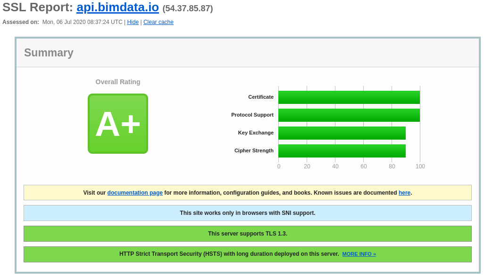

============
Security
============

.. 
    excerpt
        Here are answers on how we keep your data secure.
    endexcerpt

We treat your data with care and apply state-of-the-art security, follwing the OWASP recommandations.
Here are answers on how we keep your data secure.

Where is my BIMData hosted?
===========================

Your BIMData data and BIMData.io infrastructure are hosted in France by OVH.
Files (DMS and IFCs) are stored with `OVH Object Storage`_

How often are backups made?
============================

Your data are saved on a daily basis.

HTTPS
======

BIMData's HTTPS implementation is graded A+ on SSL Labs website.

Where do I go if I have more questions?
========================================

Please contact us by email: <support@bimdata.io>

.. OVH Object Storage: https://www.ovh.com/fr/public-cloud/object-storage/
