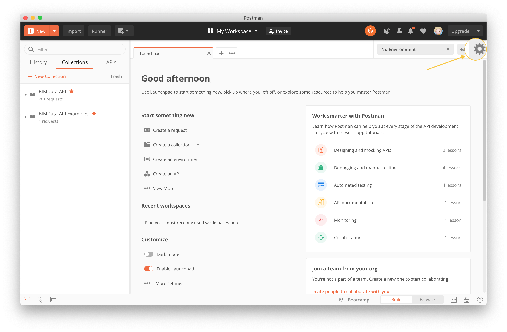
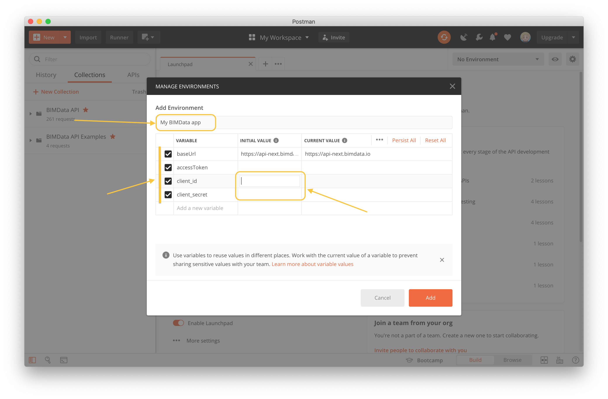

=======================================
How-to create your Postman environment
=======================================

.. 
    excerpt
        Create a Postman env to run the Auth in Postman application.
    endexcerpt

.. contents::
   depth: 2

Introduction
=============
To tryout our API and explore its capacities, we provide 2 Postman collections:

* The full API collection: https://documenter.getpostman.com/view/7460463/SzKTvyVR
* The BIMData's Examples collection: https://documenter.getpostman.com/view/7460463/SzKbLFKH

Pre-requisites
===============

* Create an application to get your ``client_id`` and ``client_secret``.
* Find it on **BIMData Connect > Manage your application**

.. note::
    
    See :doc:`the tutorial about Create an application </tutorials/dev_create_an_application>`.

Step 1: Create an environment in Postman
==========================================

Click the gear button to open the Manage Environments dialog. And click *Add* to create a new environment. 

Step 2: Create variables
=========================

In this example, we name the new environment "My BIMData App".
Then add variables by clicking in the cell "Add a new variable" and type the name of the variable.

The fields you need to create are:

* client_id
* client_secret
* accessToken: left it blank. This is filled when you run the Authentication request
* baseUrl

Fill the values
-----------------

Put the value |bimdata_connect| in the ``baseUrl`` variable.

Then fill ``client_id`` and ``client_secret`` according to your data.

Step 3: Launch the request
============================

Click `Send` and launch the Get Your Access Token request.
This request uses your environment variables such as credentials.

This request has a script in the Test part, filling the value of your environment variable ``accessToken``.

.. seealso::

    `The Postman documentation about environments and variables`_

.. _The Postman documentation about environments and variables: https://learning.postman.com/docs/postman/variables-and-environments/variables/#understanding-variables-and-environments